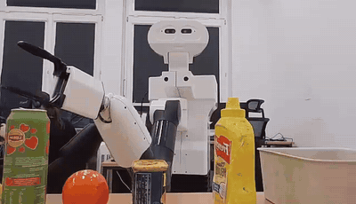
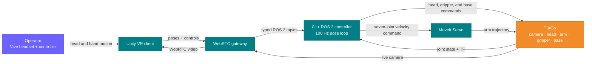
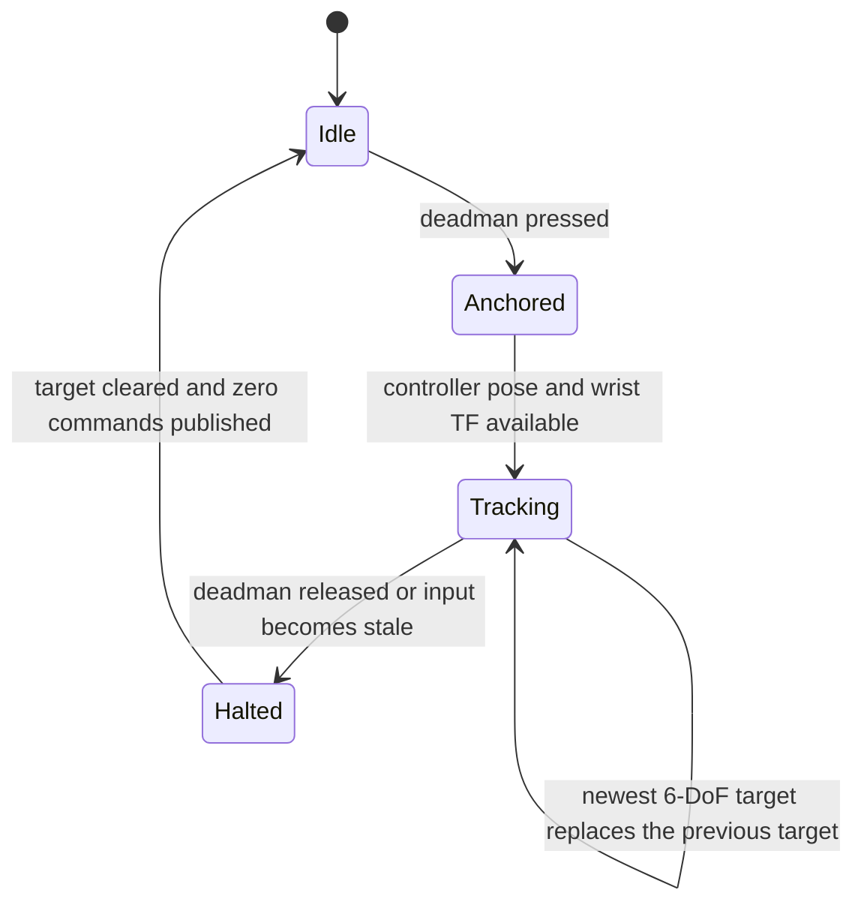

<div align="center">

<h1>Vive Teleop</h1>

<h3>Immersive VR control for the TIAGo mobile manipulator</h3>

<p>See through the robot's camera and control its arm, gripper, head, and mobile base with a Vive headset and controller.</p>

<a href="docs/assets/putting-objects-into-container.gif">
  
</a>

<p><strong>End-to-end mobile manipulation:</strong> picking up several household objects and placing them into a container.</p>

<p>
  
  
  
  
  
</p>

<p><a href="#system-overview">System overview</a> · <a href="#control-design">Control design</a> · <a href="#running-the-project">Run it</a> · <a href="docs/technical-guide.md">Technical guide</a></p>

</div>

## What it does

Vive Teleop turns consumer VR hardware into a direct robot-control station. The
operator receives the TIAGo camera feed inside the headset and controls the
robot through physical motion rather than a separate desktop interface.

| Operator input | Robot response |
| --- | --- |
| Turn or tilt the headset | Pan or tilt the robot head |
| Move the right controller while holding the deadman | Translate and rotate the robot wrist |
| Swipe the controller input without clicking | Open or close the gripper |
| Hold the controller click and push in a direction | Drive and steer the mobile base |
| Release the deadman | Stop arm pursuit and clear the active target |

The clutch-relative mapping anchors each control interval at the current robot
pose. Pressing the deadman therefore does not pull the arm toward an old target,
and the operator can release, reposition, and continue naturally.

## System overview



WebRTC keeps video transport and operator input independent from the robot
controller. The ROS 2 node closes the wrist pose loop from live TF, resolves
the Cartesian request into a seven-joint velocity command, and passes it to
MoveIt Servo for final smoothing and limit enforcement.

### Control lifecycle



## Control design

- **Responsive 6-DoF following:** a 100 Hz C++ loop combines pose feedback,
  target-velocity feed-forward, a 20 Hz target filter, and explicit Cartesian
  speed and acceleration limits.
- **Dexterity-aware arm motion:** orientation is prioritized over translation,
  wrist joints receive the lowest motion costs, and constrained joints hand
  unresolved motion to the remaining arm joints.
- **Camera-aware posture:** a bounded low-elbow objective and upward-link
  penalties keep the middle of the arm out of the operator's view without
  continuously driving the elbow toward a joint limit.
- **Limit and singularity handling:** predictive joint margins, adaptive
  damping, null-space escape, inward-only recovery, and target anti-windup keep
  the controller responsive near difficult configurations.
- **Independent control paths:** head, arm, gripper, and base inputs have their
  own deadman and timeout behavior, so unrelated controls do not block one
  another.
- **Field-network transport:** WebRTC provides low-latency video and controller
  messaging, with Coturn available when direct peer connectivity is not
  possible.

## Technology

| Layer | Implementation |
| --- | --- |
| VR client | Unity 6, SteamVR, OpenVR controller tracking |
| Media and input transport | WebRTC data channels and video, Coturn relay |
| Robot integration | ROS 2 Humble, TF2, typed command and state topics |
| Arm control | C++ resolved-rate IK and MoveIt Servo |
| Deployment | Docker Compose with wired and Wi-Fi configurations |

## Running the project

The intended setup is an Ubuntu workstation with Docker Compose, Unity 6,
SteamVR, a Vive headset/controller, and network access to a TIAGo running the
expected ROS 2 interfaces.

Start the normal Wi-Fi workflow with:

```bash
./scripts/start-vive-teleop.sh
```

The launcher brings up the ROS 2 and WebRTC services, validates the live robot
interfaces, starts SteamVR when necessary, and opens the Unity client. Detailed
configuration, network setup, controls, and troubleshooting are documented in
the [technical guide](docs/technical-guide.md).

Run non-hardware checks with:

```bash
./scripts/test-software.sh --static
```

## Additional demos

<table>
  <tr>
    <td align="center" width="50%">
      <a href="docs/assets/arm-teleop-demo.gif">
        
      </a>
    </td>
    <td align="center" width="50%">
      <a href="docs/assets/head-teleop-demo.gif">
        
      </a>
    </td>
  </tr>
  <tr>
    <td align="center"><strong>6-DoF arm control</strong></td>
    <td align="center"><strong>Headset-driven head control</strong></td>
  </tr>
</table>

## Safety

This is a supervised research prototype, not a safety-certified control
product. The current experimental Servo profile does not perform collision
checking. Operate only with the robot's physical emergency stop available,
maintain line of sight, keep the workspace clear, and use a trusted isolated
network.

## Documentation

- [Technical guide](docs/technical-guide.md) — setup, operation, configuration,
  networking, control behavior, and troubleshooting.
- [Architecture](docs/architecture/README.md) — deployment, components,
  communication paths, and class-level diagrams.
