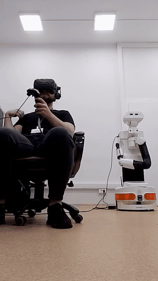
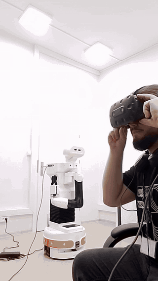
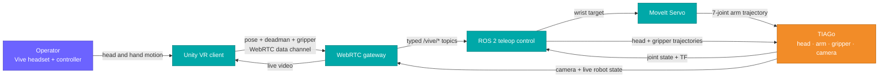

<h1>Vive Teleop</h1>

<h3>VR teleoperation for the TIAGo mobile manipulator</h3>

Look through the robot's camera, guide its seven-axis arm with a Vive controller, 
and move its head simply by looking around.

  
  
  
  
  

<a href="#demo">See the demo</a> · <a href="#how-it-works">How it works</a> · <a href="docs/technical-guide.md">Technical documentation</a>

## Demo

<table>
  <tr>
    <td align="center" width="50%">
      
    </td>
    <td align="center" width="50%">
      
    </td>
  </tr>
  <tr>
    <td align="center"><strong>6-DoF arm teleoperation</strong> The robot wrist follows clutch-relative controller movement.</td>
    <td align="center"><strong>Natural head control</strong> The robot mirrors headset pan and tilt in real time.</td>
  </tr>
</table>

Click either preview to open the full-resolution recording.

## The project

Vive Teleop turns a consumer VR system into an immersive robot-control station.
The operator sees the TIAGo camera feed inside the headset and controls the head,
arm, and gripper through familiar physical gestures—without a separate control
panel interrupting the task.

| Operator input | Robot response |
| --- | --- |
| Turn or tilt the headset | Pan or tilt the robot head |
| Move the right controller while holding the deadman | Move and rotate the robot wrist |
| Swipe the controller trackpad or joystick | Open or close the gripper |
| Release the deadman | Stop arm pursuit and clear the active target |

## How it works

The control path separates transport from robot motion. WebRTC carries video and
controller data across the network; the gateway converts input into typed ROS 2
messages; MoveIt Servo resolves wrist motion through all seven arm joints.

### Arm command lifecycle

Each press anchors the controller to the robot's current wrist pose, so engaging
control does not cause a jump. Tracking uses the headset frame captured at that
moment, allowing the operator to keep looking around without steering the arm.

## Engineering highlights

- Bidirectional WebRTC: live robot video in one direction and VR input in
  the other, with a TURN relay for the field-network setup.
- Clutch-relative 6-DoF control: controller translation and rotation are mapped
  from a fresh robot pose rather than an old absolute target.
- Layered motion handling: deadman release, stale-input timeout, workspace bounds,
  joint-limit scaling, singularity scaling, smoothing, and immediate target clear.
- Independent head, arm, and gripper paths: each control can stay responsive
  without coupling unrelated operator movement.
- Containerized deployment: Dockerized ROS 2 services, automated runtime checks,
  timestamped logs, and a browser client for debugging without VR hardware.

## Safety scope

This is a supervised research prototype, not a safety-certified robot-control
product. The current experimental Servo profile disables collision checking and
must be used only with the lab's physical emergency-stop and operating
procedure. Signaling and command ingress also assume a trusted, isolated
network; do not expose them directly to the internet.

## Explore the implementation

- [Technical guide](docs/technical-guide.md) — setup, operation, configuration,
  networking, API behavior, and troubleshooting.
- [Architecture diagrams](docs/architecture/README.md) — deployment, component,
  communication, and class-level views with PlantUML sources.
- [Project documentation](docs/README.md) — documentation index and future dataset
  recording design.
- [Engineering audit](docs/audit-2026-06-28/README.md) — prioritized safety,
  testing, recording, and portfolio roadmap plus the low-risk fix report.
