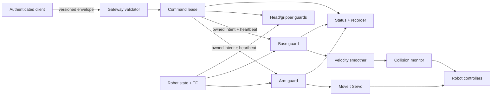

# Safety, Security and Reliability Architecture

## Safety position

This system should be described as a supervised lab research prototype. A
software deadman is useful but is not a certified emergency stop. The physical
robot's emergency stop, controller limits, workcell procedures and trained
supervision remain authoritative.

## Threat and failure model

Design for at least these conditions:

- accidental second operator or stale browser tab;
- malicious page/client on the same Wi-Fi;
- malformed, NaN, extreme or replayed commands;
- input channel closes, stalls or reconnects;
- ROS discovery drops one direction of a topic;
- TF/joint state freezes while topics remain discoverable;
- Servo, MoveIt or a controller restarts independently;
- CPU overload causes callback/command queue delay;
- TURN/signaling credentials leak;
- disk fills during logging or recording;
- base and arm commands interact dangerously;
- process shutdown happens during an active command.

## Recommended command path

### Command lease

Only one client may hold motion authority. The lease includes a random session
ID, client identity, monotonic sequence, issue/expiry times and capabilities.
Acquisition starts inactive. Reconnect never silently restores active motion.
Lease expiry, peer failure, channel close and server shutdown synchronously
clear all gates.

### Layered stop conditions

Each motion subsystem independently stops on:

- explicit deadman release;
- missing heartbeat/command timeout;
- lost command lease;
- stale or invalid robot state;
- invalid/non-finite command;
- component deactivation/fault;
- shutdown;
- physical controller rejection where observable.

The arm guard should publish repeated zero twists as it does today, while also
clearing local target/feed-forward state. The base guard should publish zero for
a configured period compatible with the base controller timeout. Stop latency
must be measured from client release and from physical network loss.

## Motion profiles

Create explicit profiles rather than one globally tuned YAML:

| Profile | Collision checking | Cartesian caps | Intended use |
| --- | --- | --- | --- |
| `simulation` | enabled | conservative | CI and development |
| `lab_safe` | enabled | measured conservative values | normal supervised operation |
| `performance_experimental` | documented choice | separately bounded | controlled experiments only |
| `replay_no_output` | no controller publishers | zero | bag analysis and tests |

The ordinary launcher must select `lab_safe`. Experimental mode should require
an explicit acknowledgement and appear prominently in status/logs/UI.

## Input validation

Validate at every trust boundary:

1. HTTP request/authentication and size.
2. JSON schema/version and strict primitive types.
3. Client/lease/sequence and source-time plausibility.
4. Finite vectors/quaternions and normalized magnitude.
5. Frame and capability allowlists.
6. Kinematic workspace, velocity and acceleration limits.
7. Fresh TF/joint/controller state.
8. Finite, bounded outgoing ROS command.

Invalid input should never toggle an active gate. Publish rejection counters and
reason codes, not raw unbounded payload logs.

## Network security

Minimum lab deployment:

- dedicated trusted operator network;
- generated TURN credentials, not `dummy:dummy`;
- authenticated signaling and command leases;
- origin allowlist;
- repository and `.env` never served;
- firewall rules exposing only required signaling/TURN ports;
- documented certificate/TLS decision.

Longer term, evaluate SROS2/DDS Security for participant authentication,
encryption and topic access controls. This is particularly valuable because any
participant on the current ROS domain can publish controller-facing topics.
Use separate enclaves for gateway, teleop controller, recorder and diagnostics,
with least-privilege topic permissions.

## Driving-specific safety

Do not publish joystick values directly to the base controller. Use a dedicated
base guard with:

- left-controller input and independent hold-to-drive deadman;
- explicit base-frame versus headset-yaw-frame choice;
- deadzone and configurable linear/angular scaling;
- velocity, acceleration and deceleration bounds;
- command timeout and repeated zero output;
- obstacle collision monitor using available laser/depth data;
- reduced speed or inhibited motion when the arm is extended;
- no automatic command restoration after localization/state loss;
- visible/haptic indication of enabled, limited and blocked states.

Verify the real controller topic and watchdog from the live TIAGo graph rather
than assuming a historical `/mobile_base_controller/cmd_vel` contract.

## Safety acceptance measurements

Publish measured distributions, not only configured values:

- deadman release to final nonzero arm command;
- cable/network loss to final nonzero command;
- stale TF detection time;
- maximum Cartesian linear/angular speed;
- maximum base linear/angular speed and acceleration;
- workspace-limit overshoot;
- singularity and collision intervention behavior;
- command rejection under NaN/extreme/fuzz input;
- behavior during gateway, MoveIt and controller restart.

Every result should include sample count, software commit, config hash, robot
mode and measurement method.
